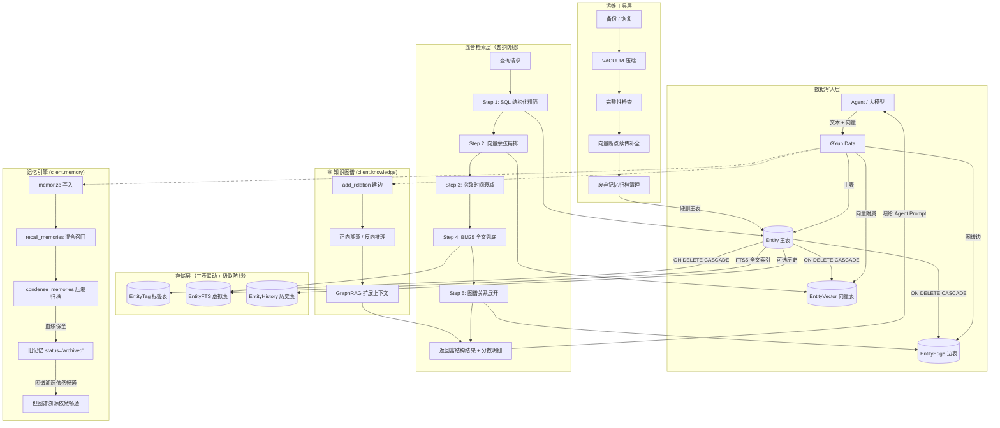

# GYun Data

> **当前版本：V3.0.1** · 本地"认知中枢" · 文本 + 向量 + 图谱三表联动
>
> - **V3.0**：`source` 升格为 **应用标识** —— 多应用数据隔离、附件按应用存储、Admin 应用上下文管理、一键删除应用
> - **V3.0.1**：旧库 `gyun_entity_tags` 外键自动补 `ON DELETE CASCADE`（自愈迁移，解决硬删报 `FOREIGN KEY constraint failed`）
> - **V2.1**：记忆引擎 + 知识图谱（GraphRAG）
> - 附：`AsyncGyunClient` 异步 API（`asyncio.to_thread` 线程池包装，事件循环零阻塞）

> **定位**：GYun Data 通过**"文本+向量+图谱"三表联动**，以五步混合检索防线（结构粗筛 → 向量精排 → 时间衰减 → 全文兜底 → 图谱展开）解决纯向量库缺乏上下文、纯图库缺乏语义模糊检索的痛点，为 Agent 提供真正的 GraphRAG 闭环。同时它依然是可靠的通用 CRUD 数据底座，台账、日志照常运行。

## 核心优势

1. **独家五路混合检索**：不仅搜得准（向量），还能想得深（图谱）。时间衰减保障新情报优先，BM25 兜底杜绝子串搜不到，图谱扩展喂饱大模型上下文。
2. **记忆 + 知识双修**：原生支持 `memorize`（记忆）、`recall`（回想）、`condense`（压缩）、`add_relation`（建边），模拟人脑遗忘与提炼，同时构建网状知识推理链路。
3. **零侵入向量托管**：底座绝不染指 Embedding 模型——你传文本，也传向量，底座只负责高效存储与安全级联计算。
4. **多应用隔离**：`source` 应用标识 + 索引过滤 + 附件目录隔离 + Admin 一键切换/删除，烂尾项目可彻底清理。
5. **100% 向下兼容**：无参 `GyunClient()` 即全局模式，老脚本零改动；旧数据 `source=NULL` 自动兼容，附件读取双路径回退。
6. **同步异步双 API**：`GyunClient`（同步）/ `AsyncGyunClient`（异步），共享同一数据库，可混用。

---

## 全局架构与流程图



---

## 数据模型：三表联动与级联防线

### 1. 主表 `Entity`（结构化记忆骨架）

| 字段 | 类型 | 语义 | 说明 |
|------|------|----------|------|
| `entity_id` | TEXT | 碎片 ID | 全局唯一，32 位 hex |
| `type` | TEXT | 记忆类型 | 如 `memory_short`, `memory_long`, `knowledge`, 或业务类型 |
| `title` | TEXT | 摘要 | 大模型生成的概括 |
| `content` | TEXT | **原始文本** | **必存原文！大模型最终阅读的载体** |
| `source` | TEXT | **应用标识** | V3.0 升格；NULL = 全局/旧数据；有索引，按应用过滤加速 |
| `priority` | INTEGER | 优先级 | 默认 0 |
| `resource_path` | TEXT | 附件相对路径 | 相对 `GYUN_RESOURCES_DIR`；新格式含 `source/` 前缀 |
| `extra` | JSON | 元数据 | `speaker`, `confidence`, `status`(active/archived) 等 |
| `related_ids` | JSON | 扁平关联 | 轻量级上下文拼接，不取代图谱 |
| `is_deleted` | INTEGER | 软删标记 | 0 正常 / 1 已软删（查询默认过滤） |
| `create_time` | INTEGER | 时间戳 | 时间衰减计算的依据 |
| `update_time` | INTEGER | 更新时间 | 归档清理的依据 |

> **索引**：`type`、`source`、`(type, is_deleted, create_time)` 联合索引。旧库升级时 peewee 自动幂等补建缺失索引，无需手动迁移。

### 2. 附属表 `EntityVector`（语义指纹库）

| 字段 | 类型 | 说明 |
|------|------|------|
| `id` | AUTO | 支持多分块、多模型向量 |
| `entity_id` | FK(CASCADE) | **防线：主表硬删时，向量自动物理擦除** |
| `embedding` | BLOB | NumPy Float32 数组 |
| `model_name` | TEXT | 防混用（断点续传按此判断） |

### 3. 边表 `EntityEdge`（知识图谱连线）

| 字段 | 类型 | 说明 |
|------|------|------|
| `id` | AUTO | 自增主键 |
| `source_id` | FK(CASCADE) | 起点（字段名 `source`）：谁发出了动作 |
| `target_id` | FK(CASCADE) | 终点（字段名 `target`）：动作作用于谁 |
| `relation_type` | TEXT (索引) | **核心：谓词（如 '学习了', '属于'）** |
| `weight` | FLOAT | 关系权重/置信度 |
| `properties` | JSON | 关系属性（如 `{'score': 95}`） |

### 4. 标签表 `EntityTag`（多对多标签）

| 字段 | 类型 | 说明 |
|------|------|------|
| `id` | AUTO | 自增主键 |
| `entity_id` | FK(CASCADE) | **防线：硬删主表时标签自动级联清除**（V3.0.1 起旧库自动补 CASCADE） |
| `tag` | TEXT | 标签名称 |

### 5. 辅助表

| 表 | 说明 |
|------|------|
| `EntityFTS` | FTS5 全文索引虚拟表（主表删除时手动同步清理） |
| `EntityHistory` | 历史快照（可选，`enable_history=True` 时启用；无外键，仅审计） |

---

## 快速开始

### 安装依赖
```bash
# 推荐：安装整个 iChen 项目（含 GYun.data 及其依赖）
pip install -e .

# 或仅手动安装最小依赖
pip install peewee jieba numpy
```

### 运行演示与管理台
```bash
# 交互式演示（CRUD/标签/全文/附件/记忆/图谱全链路，按 Enter 逐步播放）
python data/examples/demo_data.py

# Admin 交互控制台（含 V3.0 应用上下文管理）
python src/GYun/data/admin.py
```

### 场景一：原有业务 CRUD（100% 兼容）
```python
from GYun.data.client import GyunClient
client = GyunClient()

eid = client.create_entity({
    'type': 'class_log', 'title': '班会记录', 'content': '讨论了暑期安排',
    'tags': ['重要'], 'extra': {'attendees': ['张三']}
})
res = client.query_entities({'type': 'class_log'})
```

### 场景二：大模型记忆闭环（V2.1 核心）
```python
# Agent 算好向量传入
vec = [0.12, -0.34, ...]
mem_id = client.memory.memorize(
    text="亿尘最近在学 Python", embedding=vec, type='memory_long',
    extra={'speaker': '班长'}
)

# 混合召回（向量 + 时间 + 结构）
recall_res = client.memory.recall_memories(
    query_vector=query_vec, filters={'type': 'memory_long'},
    top_k=5, alpha=0.7, beta=0.2, gamma=0.1
)
for item in recall_res:
    print(f"相关度: {item['relevance_score']} | 详情: {item['final_score_detail']}")

# 记忆压缩（旧记忆归档保全血缘，绝不软删）
client.memory.condense_memories(
    source_ids=[old_id_1, old_id_2],
    condensed_text="张三具备Python能力", condensed_embedding=[...]
)
```

### 场景三：知识图谱推理（GraphRAG）
```python
# 1. 创建知识实体
python_ent = client.memory.memorize(text="Python编程语言", embedding=vec1, type='knowledge')
zhang_ent = client.memory.memorize(text="张三同学", embedding=vec2, type='profile')

# 2. 建立带谓词的连线
client.knowledge.add_relation(zhang_ent, python_ent, relation_type='学习了', properties={'score': 95})

# 3. 混合召回 + 图谱展开
recall_res = client.memory.recall_memories(
    query_vector=query_vec, filters={'type': 'knowledge'},
    top_k=1, expand_relations=True   # 🌟 开启图谱扩展！
)
if recall_res:
    for edge in recall_res[0]['expanded_knowledge']['in_relations']:
        print(f"反向推理: {edge['source_title']} [{edge['relation_type']}] -> {edge['target_title']}")
```

### 场景四：多应用隔离（V3.0）
`source` 字段为**应用标识**，用于数据按应用隔离：

```python
# 1. 实例化时指定应用：此后所有 create / query / count / search 自动注入 source 过滤
client = GyunClient(source='class_manager')

# 2. 动态切换应用上下文（Admin 控制台「应用上下文管理」即基于此实现）
client.set_source('song_ledger')   # 切到另一个应用
client.set_source(None)            # 回全局模式（不注入过滤，老脚本 100% 兼容）

# 3. 附件隔离 + 双路径回退
#    新上传附件落到 resources/{source}/{entity_id[:2]}/{entity_id}/；
#    读取时优先查新路径，文件不存在自动回退旧路径 resources/{entity_id[:2]}/{entity_id}/，
#    旧数据附件无感知兼容。
client.upload_resource(eid, 'a.png')
path = client.get_resource_path(eid)

# 4. 搜索无归属记录（旧数据 / 全局模式写入的数据，source 为 NULL）
res = client.query_entities({'source': None})
res = client.query_entities({'source': '__null__'})   # 等价写法

# 5. 一键删除整个应用（硬删主表，级联清除向量/边/标签 + 物理删除附件目录）
deleted = client.delete_application('class_manager')
```

> **兼容性**：`GyunClient()` 不带 source 即全局模式，与旧行为完全一致；已有库中 `source`
> 列自动补建索引（幂等迁移，旧数据全部为 NULL，不受影响）。**source 命名约束**：禁止空串、
> 首尾空白、路径分隔符、`.`/`..`、Windows 非法字符与保留名（CON/NUL 等），非法值抛
> `ParameterError`。

### 场景五：异步访问（AsyncGyunClient）
GYun.data 默认同步阻塞；需要非阻塞异步 API 时使用 `AsyncGyunClient`（内部
`asyncio.to_thread` 把同步操作放到线程池，事件循环不被阻塞；写操作自动加锁，
保证 SQLite 单写者下的并发安全）：

```python
import asyncio
from GYun.data.async_client import AsyncGyunClient

async def main():
    # 与同步 GyunClient 签名一一对应，source 应用隔离同样生效
    async with AsyncGyunClient(source='class_manager') as client:
        eid = await client.create_entity({'type': 'note', 'title': '异步笔记'})
        res = await client.query_entities({'type': 'note'})
        total = await client.count_entities()
        # 异步遍历（异步生成器）
        async for entity in client.iter_all_entities({'type': 'note'}):
            print(entity['title'])
        # 记忆 / 知识图谱
        await client.memory.memorize(text='重要记忆', type='memory_long')
        # 纯 query_text 召回得分上限约 alpha=0（无向量）的 beta+gamma=0.3，需调低 threshold
        recalls = await client.memory.recall_memories(query_text='重要', threshold=0.2)
        await client.knowledge.add_relation(eid, 'other_id', '关联')
    # close 自动执行；也可显式 await client.close() / client.aclose()

asyncio.run(main())
```

> **说明**：AsyncGyunClient 是同步栈的线程池包装（非 aiosqlite 真异步 IO），对本地 SQLite
> 场景足够；同步调用方继续使用 `GyunClient`，两者共享同一数据库，可混用。读写并发：读操作
> 不加锁（WAL 并发读），写操作由 `asyncio.Lock` 串行化。兼容 Python 3.8+。

---

## 配置（路径常量）

`GYun.data` 的数据位置由 `GYun.core.constants` 统一定义，**在 import GYun.data 之前**可改写
（测试隔离、多库场景）：

```python
import GYun.core.constants as consts
consts.GYUN_DB_PATH       = "D:/data/my_db.db"      # SQLite 数据库文件
consts.GYUN_RESOURCES_DIR = "D:/data/resources"     # 附件资源根目录
consts.GYUN_BACKUPS_DIR   = "D:/data/backups"       # 备份文件目录
# 然后才 import GYun.data.client ...
```

默认位置：`src/GYun/data/runtime/`（`gyun_data.db` / `resources/` / `backups/`）。

---

## 核心算法：五步混合检索数学模型

为避免分数相加的数学缺陷，`recall_memories` 采用严谨的融合公式：

$$ Score = \alpha \cdot \text{Cosine} + \beta \cdot \text{Norm(BM25)} + \gamma \cdot \text{TimeDecay} $$

1. **向量分数**：原生余弦天然 `[0, 1]`，绝不使用 Min-Max 拉扯排名。
2. **全文分数**：BM25 除以候选集最大值缩放至 `[0, 1]`；FTS 失效时降级为全表扫描兜底。
3. **时间衰减**：指数衰减 $e^{-\lambda \cdot \text{days}}$（默认 $\lambda=0.01$），杜绝 $1/log(t)$ 除零灾难。

> 注意：纯 `query_text`（无向量）召回时，理论上限约为 $\beta+\gamma=0.3$，建议传
> `query_vector` 或调低 `threshold`（如 0.2）。

---

## 运维工具与历史适配

### 断点续传补全（防重算省钱）
```python
stats1 = client.maintenance.backfill_embeddings(
    embed_func=my_embed_func, model_name='bge-m3', type_filter=['log'])
stats2 = client.maintenance.backfill_embeddings(
    embed_func=my_embed_func, model_name='bge-m3', type_filter=['log'])
# 第二次 skipped 数增加，证明绝不重复花 API 算力
```

### 归档记忆清理（级联硬删防线）
```python
to_clean = client.maintenance.gc_memories(days_unused=90, min_confidence=0.1, execute=False)
client.maintenance.gc_memories(days_unused=90, min_confidence=0.1, execute=True)
# 硬删主表，级联自动擦除向量幽灵与图谱脏边
```

### 备份 / 恢复 / 压缩 / 体检 / 附件 GC
```python
bkp = client.backup()                     # 在线备份到 GYUN_BACKUPS_DIR
client.restore(bkp)                       # 从备份文件恢复
client.vacuum()                           # VACUUM 压缩
print(client.integrity_check())           # 完整性检查
orphans = client.gc(execute=False)        # 扫描孤儿附件（execute=True 时物理删除）
```

---

## API 参考

### `GyunClient`（同步入口）

| 分类 | 方法 | 说明 |
|------|------|------|
| 应用上下文 | `source` | 当前应用标识（None = 全局） |
| | `set_source(source)` | 动态切换应用（None 回全局） |
| | `delete_application(source, cascade_resource=True)` | **一键删除应用**：硬删主表级联清向量/边/标签 + 物理删 `resources/{source}/` |
| 实体管理 | `create_entity(data)` | 创建实体（应用模式自动注入 source；支持 `tags`/`resource_file`） |
| | `get_entity(entity_id)` | 按 ID 获取 |
| | `update_entity(entity_id, update_data)` | 更新 |
| | `delete_entity(entity_id, hard=False, cascade_resource=True)` | 软删（默认）/ 硬删（级联清附属） |
| | `restore_entity(entity_id)` | 软删恢复 |
| 查询 | `query_entities(filters, order_by, order, page, page_size)` | 结构化查询（type/tags/source/时间范围/keyword_title 等） |
| | `fulltext_search(keyword, filters, ...)` | 中文全文（FTS5 + 降级兜底） |
| | `count_entities(filters)` | 计数（默认排除软删） |
| | `group_count(group_by='type', filters)` | 分组统计 |
| | `iter_all_entities(filters, batch_size)` | 全量迭代（生成器） |
| | `get_entities_batch(ids)` / `get_related_entities(eid)` / `get_referenced_entities(eid)` | 批量 / 关联（related_ids）/ 反向关联 |
| 附件 | `upload_resource(eid, file_path)` / `get_resource_path(eid)` / `delete_resource(eid)` | 上传 / 取绝对路径（双路径回退）/ 删除 |
| 批量 | `batch_create_entities(data_list, on_error='rollback')` / `batch_update_entities(filters, update_data)` | 批量创建 / 批量更新（事务） |
| 运维 | `backup()` / `restore(backup_file)` / `vacuum()` / `integrity_check()` / `gc(execute=False)` | 见上节 |
| | `maintenance.backfill_embeddings(...)` / `maintenance.gc_memories(...)` | 断点续传补全 / 归档清理 |
| 钩子 | `register_hook(hook_type, func)` | 注册 before/after 钩子 |
| 生命周期 | `close()` | 关闭数据库连接 |

### 记忆引擎（`client.memory`）

| 方法 | 说明 |
|------|------|
| `memorize(text, embedding=None, type='memory_long', extra=None, **kwargs)` | 记忆写入（自动注入 source） |
| `recall_memories(query_vector=None, query_text=None, filters=None, top_k=5, threshold=0.5, alpha=0.7, beta=0.2, gamma=0.1, expand_relations=False)` | **混合召回**（可开启图谱扩展） |
| `condense_memories(source_ids, condensed_text, condensed_embedding=None)` | 记忆压缩（旧记忆归档保全血缘） |

### 知识图谱（`client.knowledge`）

| 方法 | 说明 |
|------|------|
| `add_relation(source_id, target_id, relation_type, properties=None, weight=1.0)` | 建立带谓词连线 |

> 关系查询暂未在 `client.knowledge` 暴露，需要正向/反向溯源时直接使用存储层：
> ```python
> from GYun.data.storage.edge_storage import EdgeStorage
> EdgeStorage.query_edges(source_id=eid)   # 正向：张三学习了什么？
> EdgeStorage.query_edges(target_id=eid)   # 反向：谁学习了 Python？
> ```

### `AsyncGyunClient`（异步入口）

方法与同步 `GyunClient` 一一对应（`await` 调用），子服务 `memory`/`knowledge` 同样提供
异步版。详见上文**场景五**。

---

## FAQ

**Q1: 为什么召回结果里，相似度极高的旧记忆排在了新记忆后面？**
**答**：因为引入了指数时间衰减。0.99 相似度但 100 天前的记忆，其最终得分会自然低于刚发生的新记忆。若需绝对无视时间，设置 `gamma=0`。

**Q2: 记忆压缩 (`condense`) 后，旧记忆为什么没有消失？**
**答**：为了保全血缘图谱！底座将旧记忆标记为 `extra.status='archived'` 并写入 `condensed_into` 指向新记忆，图谱溯源依然畅通。注意：当前版本召回默认**不过滤** archived 状态（与普通实体一视同仁）；若希望召回时忽略旧记忆，请在业务层按 `extra.status` 自行过滤（未来版本将内置归档过滤）。

**Q3: 搜"人工智"为什么能命中"人工智能"？**
**答**：底座采用双重防线。FTS5 整词粗筛提速，若失败则**降级为全表扫描 + Python 子串过滤**，确保绝不漏召回。

**Q4: 知识图谱的关系和 `related_ids` 有什么区别？**
**答**：`related_ids` 是扁平数组，适合轻量级上下文拼接（如对话上下文）；`EntityEdge` 是带谓词和属性的结构化连线，适合深度推理溯源（如 张三[学习了]Python）。两者共存，按需选择。

**Q5: 硬删除实体时，还要手动去清向量表和边表吗？**
**答**：绝对不要！`EntityVector`、`EntityEdge`、`EntityTag` 均配置了 `ForeignKey(CASCADE)`。主表硬删一行，底层自动物理擦除所有附属数据，绝无幽灵。

**Q6: 硬删实体报 `FOREIGN KEY constraint failed` 怎么办？**
**答**：这是**旧库**（V3.0.1 之前创建）的 `gyun_entity_tags` 表外键缺少 `ON DELETE CASCADE` 所致。**V3.0.1 起无需手动处理**——`init_db()` 启动时自动检测并幂等重建该表补上 CASCADE（先在线备份，数据无损）。若仍报错，请确认应用已运行过最新版 `init_db`（重新启动一次即可），或从 `runtime/backups/` 恢复后重试。

**Q7: `source` 是什么？会影响老数据吗？**
**答**：`source` 是 V3.0 引入的**应用标识**，用于多应用数据隔离（过滤、统计、附件目录、一键删除）。老数据 `source` 全部为 NULL（全局/无归属），行为与以前完全一致；也可用 `client.query_entities({'source': None})` 或 `'__null__'` 显式检索无归属记录。详见**场景四**。

**Q8: 为什么我显式传了 `source` 却不生效？**
**答**：应用模式下 `GyunClient(source='x')` 只对**未显式指定** `source` 的 create/query 自动注入（注入而非强制覆盖），显式传值优先——这是刻意的设计（如跨应用迁移）。若需要强隔离，请通过 `set_source` 切换上下文，业务代码不传该键。
